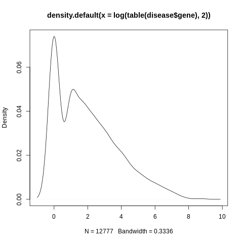
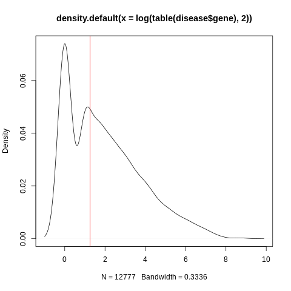
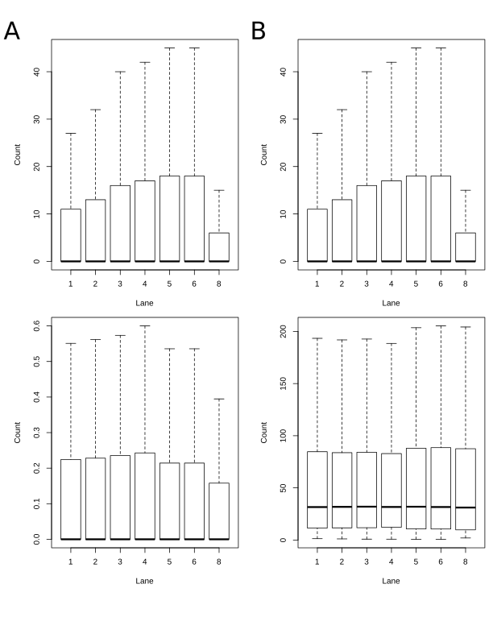

# Homework #3

## <u>Assignment 1</u>
First, I used the head and tail commands in the command line to cat only the data into a new text file. Since R's *read.table()* uses whitespace as a default separator I didn't have to worry about whether I had spaces or tabs between the columns and the columns loaded appropriately. I then subset the dataframe to get only the `Disease` genes, counted the Disease genes, sorted the table, and indexed only the first 5:
```{r, eval = FALSE}
disease <- subset(disease, change == "Disease")
sort(table(disease$gene), decreasing = TRUE)[1:5]
```

**(1A)**Which gave me the resuling genes:

1. F8 - 472
2. SCN1A - 405
3. FBN1 - 393
4. ABCA4 - 231
5. PAH - 222

To next plot the frequency distribution, I took the count table of the genes and ran a histogram of the counts with additional breaks. What I noticed, however, was that the graph was heavily skewed, so I regraphed the histogram using the $\log_{2} a$ transformed counts. I then added a vline with the x-intercept set to the average of the transformed counts:
**(1B)**
```{r, eval = FALSE}
plot(density(log(table(disease$gene), 2)))
```

This results in the following image:



**(1C)**
```{r, eval=FALSE}
abline(v = log(mean(table(disease$gene)), 2), col = "red")
```

Which results in the following image:


## <u>Assignment 2</u>
**(2A)**
For the first part of this assignment, we were told to write a script that would perform upper-quartile normalization on a dataset. This was easily done by diving each count by the upper-quartile value of that dataset. Since I ignored the zero values, the new upper-quartiles don't exactly line up, but its much improved over the unnormalized distributions:

```{r, eval=FALSE}
#This part grabs and opens the file, storign the counts in 'counts'
args <- commandArgs(trailingOnly = TRUE)
counts <- read.table(args[1], header = TRUE, sep = "\t", row.names = 1)

#This part divides each column by the upper quartile value (ignoring 0 values)
counts_q <- sapply(counts, function(x){x/quantile(x[x != 0])[4]})

#This part saves it as a file
write.table(counts_q, file = paste0(args[1], "_quartiled.txt"))
```

For the Second part of this problem, we were told to write a script that will hand-calculate the DESeq2 normalized counts of a dataset. To do this, I looked up the process for [DGE count normalization](https://hbctraining.github.io/DGE_workshop/lessons/02_DGE_count_normalization.html). The process is to:

1. Find the geometric mean of each gene across experiments
2. Divide each gene row by these values
3. For each experiment, calculate the normalization factor by finding the median of the normalized values
4. Divide the original counts of each experiment by the normalization factor

```{r, eval=FALSE}
args <- commandArgs(trailingOnly = TRUE)
counts <- read.table(args[1], header = TRUE, sep = "\t", row.names = 1)

counts_no_zeroes <- counts
ls <- c()

for (i in 1:dim(counts_no_zeroes)[1]){
  if (sum(counts[i,] == 0)){
    ls <- append(ls, i)
  }
}
counts_no_zeroes <- counts[-ls, ]

#To make life easy, I used the geoMean() function in the EnvStats package
library(EnvStats)

#First, we assign holder values for the data
counts_geo_1 <- counts_no_zeroes
counts_geo_2 <- counts_no_zeroes

#Then we generate a vector of geometric means of each row/gene
pseudo <- apply(counts_no_zeroes, MARGIN = 1, function(x){geoMean(x[x != 0])})

#Then we divide each value by the geoMean of its respective row
for (i in 1:dim(counts_no_zeroes)[1]){
  counts_geo_1[i,] <- counts_no_zeroes[i,]/pseudo[i]
}

#Now we get a vector of the medians of each dataset
pseudo_2 <- apply(counts_geo_1, MARGIN = 2, function(x){median(x[x != 0])})

#Now we divide each value by the normalizing factor of that dataset
for (i in 1:dim(counts_no_zeroes)[2]){
  counts_geo_2[,i] <- counts_no_zeroes[,i]/pseudo_2[i]
}

write.table(counts_geo_2, file = paste0(args[1], "_DESeq_count.txt"))
```

Both these scripts were saved as .R files and tested in the command line using `Rscript xx.R yy.txt`.

**(2B)**
For the second part of assignment two, we were told to use the pnas_expression.txt file and generate a 2x2 plot of the before-and-after count normalization. Interestingly, the pnas data also includes a length variable corresponding to the length of the sequence. This is likely present to allow for normalization as FPKM from the count data. It suddenly occured to me that I don't know if DESeq normalization or upper quartile normalization should be done on length adjusted data or not. I would assume the data does need to be adjusted by length, since the UQ/DESeq normalization is for adjusting between samples not between genes within samples. That being said, the problem doesn't state is the PNAS expression file is already adjusted or not. With additional information, I will assume the data has either already been normalized by length and/or that the DESeq/UQ normalization does not require this step, and cut the ``len`` column off the dataset. In the figure below, Panel A is the UQ-normalized data and Panel B is the DESeq noramlized data. Due to the omission of zero-counts, as mentioned previously, the UQ's and medians don't exactly line up, but it is much improved over the unnormalized data.

